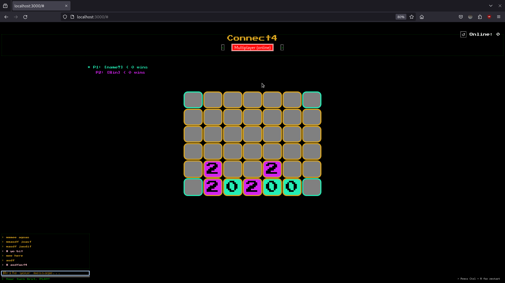

# Connect4

A classic Connect Four board game with multiple playing modes, implemented using JavaScript.

[Online Version:](http://curous.live:3000/) {transient}
[Static Version:](https://peonix0.github.io/connect4/public/) {persistence}

## Features

- **Interactive Gameplay**: Play against the computer, a friend in two-player mode, or watch AI vs AI.
- **AI Opponent**: The AI uses Minimax with Alpha-Beta pruning for challenging gameplay.
- **Multiplayer Mode**: Play online with friends.
- **Dumb AI**: A simpler AI logic for less challenging gameplay.
- **Chat Feature**: Allows two online players to communicate during the game with some delay due to the HTTP protocol.

## Technical Details

- **Backend**: Implemented using Node.js HTTP module instead of Express.js, offering a deeper understanding of backend challenges and reasons for using frameworks.
- **Real-Time Gameplay**: Although WebSockets could have been used for real-time responses, the project uses simple HTTP to handle multiple requests for updates, providing insight into the complexity of HTTP protocol.

## Getting Started

### Prerequisites

- Node.js

### Installation

1. Clone the repository:
   ```bash
   git clone https://github.com/peonix0/connect4.git
   ```
2. Navigate to the project directory:
   ```bash
   cd connect4
   ```
3. Install the dependencies:
   ```bash
   npm install
   ```

### Running the Game

1. Start the server:
   ```bash
   node app.js
   ```
2. Open your browser and go to `http://localhost:3000`.

## Project Structure

- `public/`: Contains static files (HTML, CSS, JavaScript).
- `utils/`: Includes utility functions for backend.
- `app.js`: Main server file and all routing.

## Preview
The Connect4 game interface showcasing the board, multiplayer mode, and chat feature.


